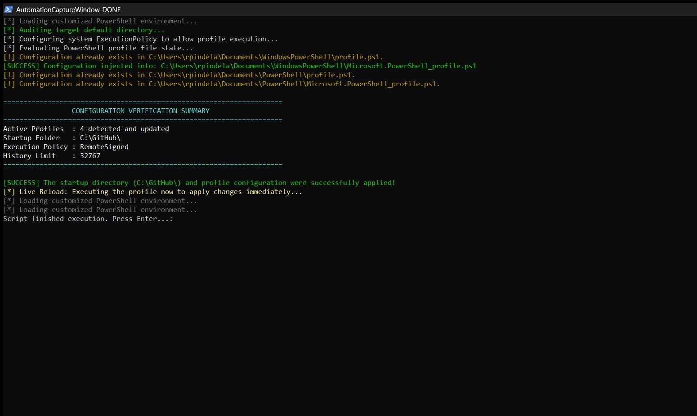
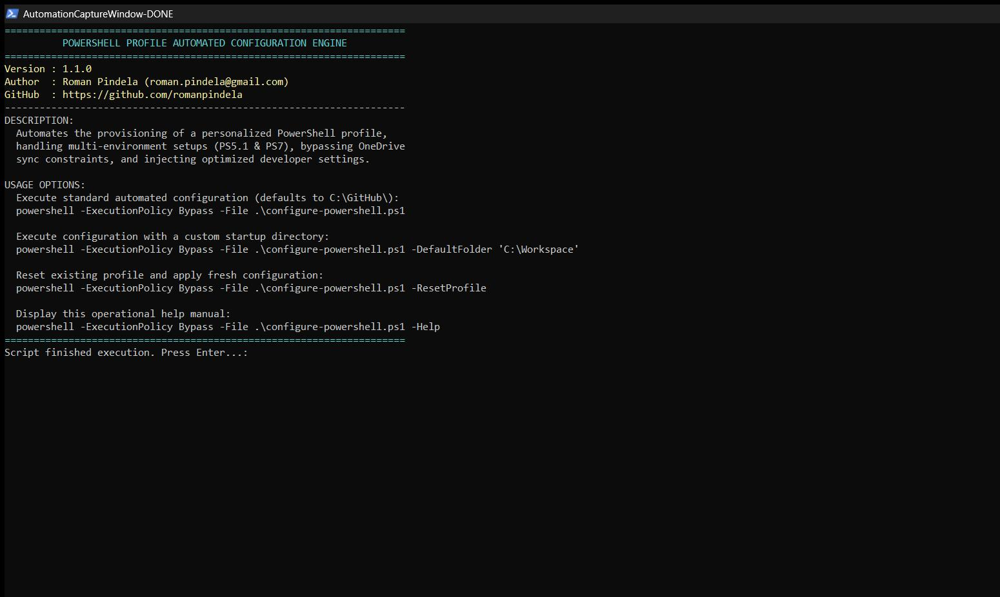

# Configure PowerShell Profile

An enterprise-grade automation script written in PowerShell to initialize and configure your local user profile. It applies standard quality-of-life enhancements and establishes a default workspace directory right at the shell's startup.

## Features

- **Automated Directory Provisioning:** Checks if your target startup directory (e.g., `C:\GitHub`) exists, and dynamically creates it if it doesn't.
- **Multi-Environment Resilience:** Automatically detects and provisions profiles for both Windows PowerShell 5.1 and PowerShell Core 7+, robustly handling missing parent directories (e.g., uninitialized OneDrive paths).
- **Intelligent Autocomplete & History:** Injects settings for `PSReadLine` to enable smart autocomplete from your command history (`PredictionSource History`).
- **Optimized Developer Settings:**
  - Adjusts history counts to keep maximum allowed logs (`$MaximumHistoryCount = 32767`).
  - Disables the annoying system bell (`BellStyle None`).
  - Ensures cursor moves to the end of history searches.
  - Sets the execution policy for the current user to `RemoteSigned` for easier script execution.
- **Live Reloading:** Immediately sources the newly configured profile into your active session without requiring a terminal restart.
- **Interactive Help System:** Built-in console manual using standard PowerShell practices.

## Usage

To configure your profile using the default `C:\GitHub\` directory, simply run:

```powershell
powershell -ExecutionPolicy Bypass -File .\configure-powershell.ps1
```

### Arguments

| Argument | Type | Description | Required | Default |
| :--- | :--- | :--- | :--- | :--- |
| `-DefaultFolder` | String | Defines the absolute path to your default development directory. | No | `C:\GitHub\` |
| `-Help` | Switch | Displays the script's operational manual. | No | `False` |
| `-ResetProfile` | Switch | Safely wipes existing configurations from all detected profiles before applying fresh settings. | No | `False` |

### Example - Custom Workspace

If you want to set your start folder to another path, pass it using `-DefaultFolder`:

```powershell
powershell -ExecutionPolicy Bypass -File .\configure-powershell.ps1 -DefaultFolder "C:\GitHub\Workspace"
```

*Note: Make sure to restart your PowerShell session after execution for the changes to take effect.*

## Execution View

### Standard Run


### Help Output (-Help)

